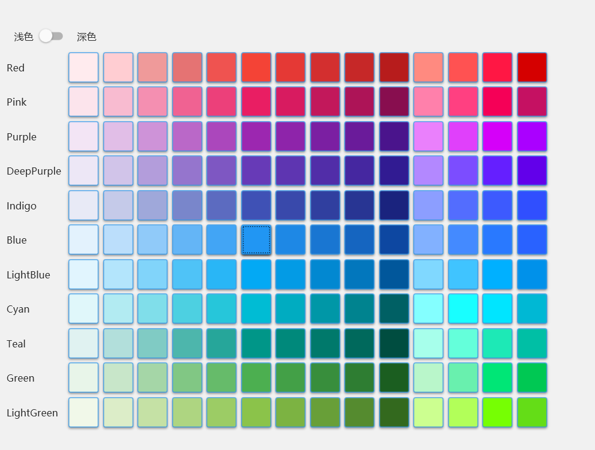

本文是关于WPF (Windows Presentation Foundation) 的学习笔记，主要涵盖了WPF的布局系统、命名规则、资源管理、动画效果以及数据绑定等核心概念。通过这些基础知识，可以帮助开发者构建功能丰富、界面美观的Windows桌面应用程序。

<!--truncate-->

# 布局

- Grid
- StackPanel
- DockerPanel

# 命名

- 控件命名：如 x:Name="btn"
- style命名：如 x:Key="btnStyle"

# 资源

1. DynamicResource，运行时可动态改变
2. StaticResource，仅第一次生效，资源发生改变不会影响

# 动画

命名空间：System.Windows.Media.Animation

1. 线性动画

   值类型+Animation，如DoubleAnimation

2. 关键帧动画

   值类型+AnimationUsingKeyFrames，如DoubleAnimationUsingKeyFrames

3. 路径动画

​	值类型+AnimationUsingPath，如DoubleAnimationUsingPath

# 绑定

## 控件与控件的绑定


1. OneTime: 仅第一次绑定时会变
2. OneWay: 本身值改变，不会影响源，而源会影响本身
3. OneWayToSource：源改变不会影响本身值，而控件会影响源
4. TwoWay: 默认，双向绑定

## 绑定数据

通过DataContext上下文绑定

# MVVM

## 1、绑定命令

ui和业务方法分离，**ICommand**接口 

## 2、通知更新

属性变更会更新UI，**INotifyPropertyChanged**接口，**属性Set方法中调用PropertyChanged事件**

PS: [CallerMemberName]属性修饰方法形参可以获取属性名称

## MVVM框架

| 框架                                      | 通知更新               | 命令            | 消息                                |      |
| ----------------------------------------- | ---------------------- | --------------- | ----------------------------------- | ---- |
| 原生                                      | INotifyPropertyChanged | ICommand        |                                     |      |
| MvvmLight                                 | ViewModelBase          | RelayCommand    | Messenger(消息注册、发送、取消注册) |      |
| Microsoft.Toolkit.Mvvm(MvvmLight的扩展版) | ObservableObject       | RelayCommand    | WeakReferenceMessenger              |      |
| Prism                                     | BindableBase           | DelegateCommand |                                     |      |


# Prism

自动查找上下文（绑定ViewModel

``` xml
<window
xmlns:prism="https://prismlibrary.com/"
prism:ViewModelLocator.AutoWireViewModel="True"
```

PrismApplication重写方法

1. **CreateShell**(): **返回首页View**

   ``` c#
   return Container.Resolve<MainView>();
   ```

2. **RegisterTypes**(IContainerRegistry containerRegistry): **注册服务（如视图**

   ``` c#
   containerRegistry.RegisterForNavigation<ViewA>();
   ```

## 1、区域

- 解决导航路由难维护的问题
- 访问历史，eg 返回上一页

1. 设定区域名字

   ```xml
   <ContentControl prism:RegionManager.RegionName="ContentRegion" />
   ```

2. ViewModel注入**IRegionManager**

   ``` c#
   regionManager.Regions["ContentRegion"].RequestNavigate("ViewA");
   ```

## 2、模块化

模块类库中需实现 **IModule**接口，如ModuleAProfile : IModule

- **OnInitialized**(IContainerProvider containerProvider)：**初始化**
- **RegisterTypes**(IContainerRegistry containerRegisatry): **注册服务（如视图**

主程序中引用模块有两种方式：

1. 代码：需引入dll

   App中重写ConfigureModuleCatalog(IModuleCatalog moduleCatalog)

   ``` c#
   moduleCatalog.AddModule<ModuleAProfile>();
   base.ConfigureModuleCatalog(moduleCatalog);
   ```

2. 配置：

   - 指定Module文件夹：App中重写CreateModuleCatalog()方法

     ``` c#
     retrun new DirectoryModuleCatalog() { Module = @".\Modules" };
     ```

   - 将Module的dll放进文件夹

## 3、导航

**INavigationAware**接口(ViewModel继承)

三个需实现的方法

- bool **IsNavigationTarget**(NavigationContext navigationContext)

  每次重新导航时，该实例是否重用，false的话就会重新创建

- void **OnNavigatedFrom**(NavigationContext navigationContext)

  拦截导航请求，也可用**IConfirmNavigationRequest**接口，重写**ConfimNavigationRequest**方法

- void **OnNavigatedTo**(NavigationContext navigationContext)

  ``` c#
  //获取导航时传过来的参数
  if(navigationContext.Parameters.ContainsKey("Title"))//需要进行判空，否则空的话会报异常
  { 
      navigationContext.Parameters.GetValue<string>("Title");//从字典中拿参数
  }
  ```

### 导航日志

定义该字段 **IRegionNavigationJournal** journal, 开始为空，由RequestNavigate方法去维护

``` c#
regionManager.Regions["ContentRegion"].RequestNavigate(viewName, callBack =>
{
    if((bool)callBack.Result)
    {
    	journal = callBack.Context.NavigationService.Journal;   
    }
}, keys)
```

journal方法：GoBack()、GoForward()、Clear()

## 4、对话服务（弹窗）

- ViewModel实现**IDialogAware**接口

- 注册Dialog

  ``` c#
  containerRegistry.RegisterDialog<ViewC>();
  ```

- 注入**IDialogService** dialogService

  ``` c#
  dialogService.ShowDialog(msg);
  ```

## 5、发布订阅

消息：继承**PubSubEvent\<T\>**, 如 MessageEvent : PubSubEvent\<string\>

发布订阅：注入该**IEventAggregator**接口

``` c#
//发布：向订阅了MessgaeEvent消息的人发送“Hello”
aggregator.GetEvent<MessageEvent>().Publish("Hello");

//订阅：接受消息
aggregator.GetEvent<MessageEvent>().Subscribe(arg => 
{
    MessageBox.Show($"接收到消息：{arg}");
});
//UnSubcribe方法取消订阅
```

## 6、动画

#### OpeningEffect

进入效果：ExpandIn、FadeIn 等

``` xml
<md:TransitioningContent OpeningEffect="{md:TransitionEffect Kind=ExpandIn}">
<!-- 内容 -->                           
</md:TransitioningContent>
```


# 行为

用于绑定行为，触发命令

1. 引入命名空间

   ``` xml
   <Window 
   xmlns:i="http://schemas.microsoft.com/xaml/behaviors"
   ```

2. 在要绑定的元素中编写，如下：事件为SelectionChanged，触发NavigateCommand

   ``` xml
   <i:Interaction.Triggers>
       <i:EventTrigger EventName="SelectionChanged">
           <i:InvokeCommandAction Command="{Binding NavigateCommand}" CommandParameter="{Binding ElementName=menuBar, Path=SelectedItem}" />
       </i:EventTrigger>
   </i:Interaction.Triggers>
   ```


# 控件

## ItemsControl控件

用于显示**集合**数据的控件

``` xaml
<ItemsControl>
    <ItemsControl.ItemsPanel>
        <ItemsPanelTemplate>
            <WrapPanel />
        </ItemsPanelTemplate>
    </ItemsControl.ItemsPanel>
    <ItemsControl.ItemTemplate>
        <DataTemplate>
            
        </DataTemplate>
    </ItemsControl.ItemTemplate>
</ItemsControl>
```

## ScrollViewer控件

可包裹其他控件，使其**支持滚动**

## ContentControl控件

一般用于导航内容，有点像Vue中的RouterView标签

```xml
<ContentControl Grid.Column="1" prism:RegionManager.RegionName="{x:Static ext:PrismManager.SettingsViewRegionName}" />
```

# ！异常解决

## 1、IOException: 找不到资源 “themes/materialdesigntheme.defaults.xaml”。

版本升级导致命名变了，需改为如下：

```xml
<ResourceDictionary.MergedDictionaries>
    <materialDesign:BundledTheme
        BaseTheme="Light"
        PrimaryColor="DeepPurple"
        SecondaryColor="Lime" />
    <ResourceDictionary Source="pack://application:,,,/MaterialDesignThemes.Wpf;component/Themes/MaterialDesign2.Defaults.xaml" />
</ResourceDictionary.MergedDictionaries>
```

# Demo

## 主题调色板(SkinView)

基于 **MaterialDesign** 样式框架

**App.xaml** 配置**Resource** （引用MaterialDesign的主题）

``` xaml
<prism:PrismApplication
    x:Class="MyToDo.App"
    xmlns="http://schemas.microsoft.com/winfx/2006/xaml/presentation"
    xmlns:x="http://schemas.microsoft.com/winfx/2006/xaml"
    xmlns:local="clr-namespace:MyToDo"
    xmlns:materialDesign="http://materialdesigninxaml.net/winfx/xaml/themes"
    xmlns:prism="http://prismlibrary.com/">
    <Application.Resources>
        <ResourceDictionary>
            <ResourceDictionary.MergedDictionaries>
                <materialDesign:BundledTheme
                    BaseTheme="Light"
                    PrimaryColor="DeepPurple"
                    SecondaryColor="Lime" />

                <ResourceDictionary Source="pack://application:,,,/MaterialDesignThemes.Wpf;component/Themes/MaterialDesign2.Defaults.xaml" />
            </ResourceDictionary.MergedDictionaries>
```

**ColorToBrushConverter.cs **(在SkinView.xaml中用到)

``` c#
using System.Globalization;
using System.Windows.Data;
using System.Windows.Media;

namespace MyToDo.Extensions
{
    [ValueConversion(typeof(Color), typeof(Brush))]
    public sealed class ColorToBrushConverter : IValueConverter
    {
        public object? Convert(object? value, Type targetType, object? parameter, CultureInfo culture)
        {
            if (value is Color color)
            {
                SolidColorBrush rv = new(color);
                rv.Freeze();
                return rv;
            }
            return Binding.DoNothing;
        }

        public object? ConvertBack(object? value, Type targetType, object? parameter, CultureInfo culture)
        {
            if (value is SolidColorBrush brush)
            {
                return brush.Color;
            }
            return default(Color);
        }
    }
}

```

**SkinView.xaml** (View)

``` xaml
<UserControl
    x:Class="MyToDo.Views.SkinView"
    xmlns="http://schemas.microsoft.com/winfx/2006/xaml/presentation"
    xmlns:x="http://schemas.microsoft.com/winfx/2006/xaml"
    xmlns:d="http://schemas.microsoft.com/expression/blend/2008"
    xmlns:ext="clr-namespace:MyToDo.Extensions"
    xmlns:local="clr-namespace:MyToDo.Views"
    xmlns:materialDesignColors="clr-namespace:MaterialDesignColors;assembly=MaterialDesignColors"
    xmlns:mc="http://schemas.openxmlformats.org/markup-compatibility/2006"
    d:DesignHeight="450"
    d:DesignWidth="800"
    mc:Ignorable="d">
    <UserControl.Resources>
        <ext:ColorToBrushConverter x:Key="ColorToBrushConverter" />
        <DataTemplate x:Key="SwatchColorTemplate" DataType="{x:Type Color}">
            <Button
                Width="40"
                Height="40"
                Margin="3"
                Background="{Binding Converter={StaticResource ColorToBrushConverter}}"
                BorderThickness="1"
                Command="{Binding DataContext.ChangeHueCommand, RelativeSource={RelativeSource AncestorType=local:SkinView}}"
                CommandParameter="{Binding}" />
        </DataTemplate>
    </UserControl.Resources>
    <Grid>
        <Grid.RowDefinitions>
            <RowDefinition Height="auto" />
            <RowDefinition />
        </Grid.RowDefinitions>
        <StackPanel Margin="10" Orientation="Horizontal">
            <TextBlock VerticalAlignment="Center" Text="浅色" />
            <ToggleButton Margin="8,0,16,0" IsChecked="{Binding IsDarkTheme}" />
            <TextBlock VerticalAlignment="Center" Text="深色" />
        </StackPanel>
        <ItemsControl Grid.Row="1" ItemsSource="{Binding Swatches}">
            <ItemsControl.ItemTemplate>
                <DataTemplate DataType="{x:Type materialDesignColors:ISwatch}">
                    <StackPanel Orientation="Horizontal">
                        <TextBlock
                            Width="80"
                            VerticalAlignment="Center"
                            Text="{Binding Name, Mode=OneTime}" />
                        <ItemsControl ItemTemplate="{StaticResource SwatchColorTemplate}" ItemsSource="{Binding Lookup.Values, Mode=OneTime}">
                            <ItemsControl.ItemsPanel>
                                <ItemsPanelTemplate>
                                    <VirtualizingStackPanel Orientation="Horizontal" />
                                </ItemsPanelTemplate>
                            </ItemsControl.ItemsPanel>
                        </ItemsControl>
                    </StackPanel>
                </DataTemplate>
            </ItemsControl.ItemTemplate>
        </ItemsControl>
    </Grid>
</UserControl>
```

**SkinViewModel.cs** (ViewModel)

``` c#
using MaterialDesignColors;
using MaterialDesignColors.ColorManipulation;
using MaterialDesignThemes.Wpf;
using System.Windows.Media;

namespace MyToDo.ViewModels
{
    public class SkinViewModel : BindableBase
    {
        public SkinViewModel()
        {
            ChangeHueCommand = new DelegateCommand<object>(ChangeHue);
        }

        private bool _isDarkTheme;
        public bool IsDarkTheme
        {
            get => _isDarkTheme;
            set
            {
                if (SetProperty(ref _isDarkTheme, value))
                {
                    ModifyTheme(theme => theme.SetBaseTheme(value ? BaseTheme.Dark : BaseTheme.Light));
                }
            }
        }

        public IEnumerable<ISwatch> Swatches => SwatchHelper.Swatches;
        public DelegateCommand<object> ChangeHueCommand { get; private set; }

        private readonly PaletteHelper paletteHelper = new PaletteHelper();
        private void ChangeHue(object obj)
        {
            var hue = (Color)obj;
            Theme theme = paletteHelper.GetTheme();
            theme.PrimaryLight = new ColorPair(hue.Lighten());
            theme.PrimaryMid = new ColorPair(hue);
            theme.PrimaryDark = new ColorPair(hue.Darken());
            paletteHelper.SetTheme(theme);
        }

        private static void ModifyTheme(Action<Theme> modificationAction)
        {
            var paletteHelper = new PaletteHelper();
            Theme theme = paletteHelper.GetTheme();
            modificationAction?.Invoke(theme);
            paletteHelper.SetTheme(theme);
        }
    }
}
```

**MainView.xaml** (主窗体需要配置，才能实现全局的主题切换)

``` xaml
<Window
    x:Class="MyToDo.Views.MainView"
    xmlns="http://schemas.microsoft.com/winfx/2006/xaml/presentation"
    xmlns:x="http://schemas.microsoft.com/winfx/2006/xaml"
    xmlns:d="http://schemas.microsoft.com/expression/blend/2008"
    xmlns:ext="clr-namespace:MyToDo.Extensions"
    xmlns:i="http://schemas.microsoft.com/xaml/behaviors"
    xmlns:local="clr-namespace:MyToDo"
    xmlns:materialDesign="http://materialdesigninxaml.net/winfx/xaml/themes"
    xmlns:mc="http://schemas.openxmlformats.org/markup-compatibility/2006"
    xmlns:prism="http://prismlibrary.com/"
    Title="MainWindow"
    Width="1280"
    Height="768"
    prism:ViewModelLocator.AutoWireViewModel="True"
    AllowsTransparency="True"
    Background="{DynamicResource MaterialDesignPaper}"
    FontFamily="微软雅黑"
    Style="{StaticResource MaterialDesignWindow}"
    TextElement.FontSize="13"
    TextElement.FontWeight="Regular"
    TextElement.Foreground="{DynamicResource MaterialDesignBody}"
    TextOptions.TextFormattingMode="Ideal"
    TextOptions.TextRenderingMode="Auto"
    WindowStartupLocation="CenterScreen"
    WindowStyle="None"
    mc:Ignorable="d">
```

SkinView页面效果：

