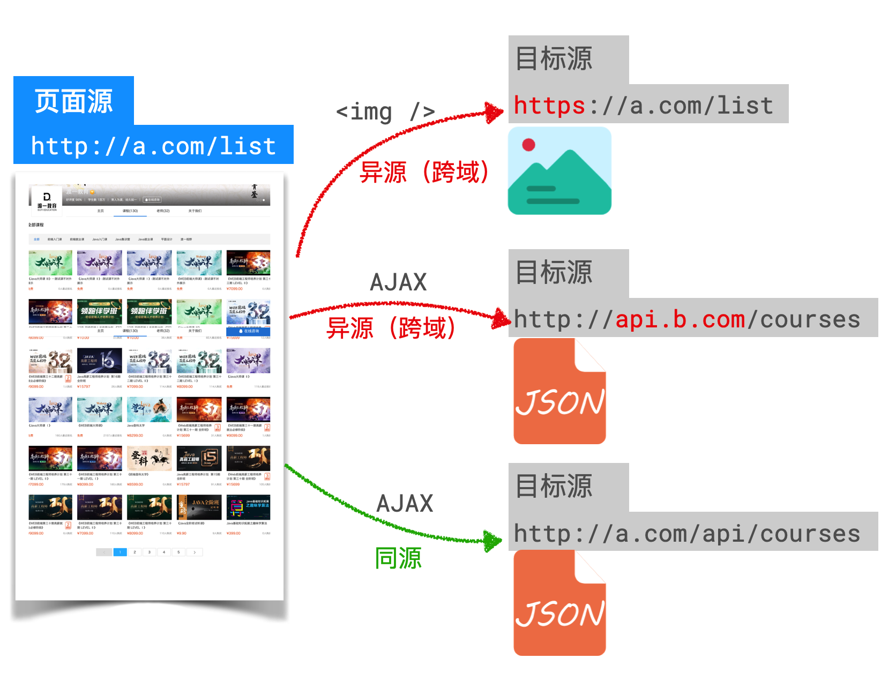
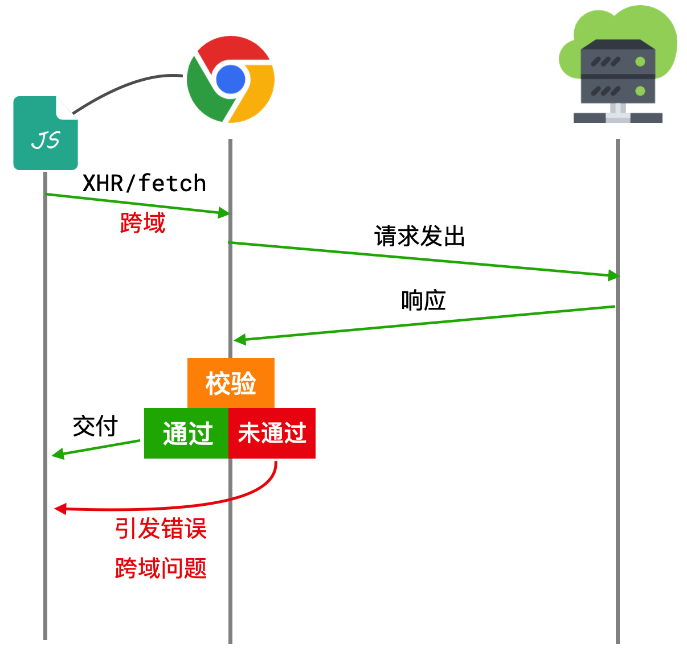
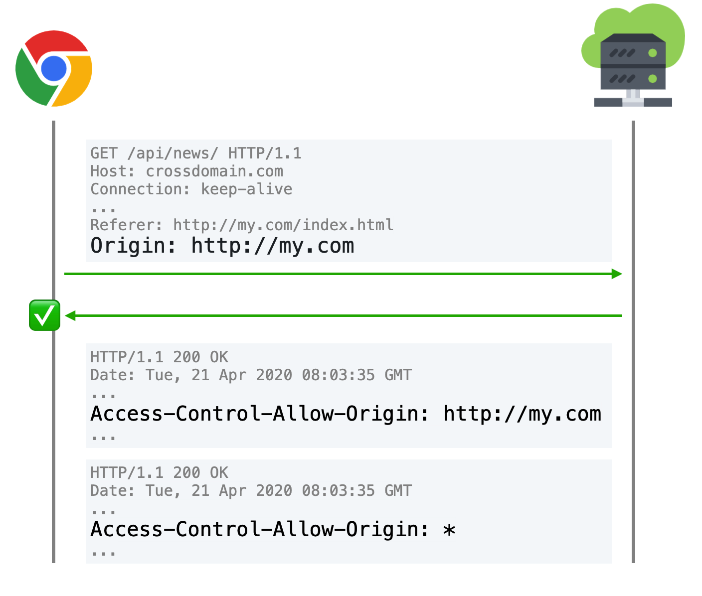
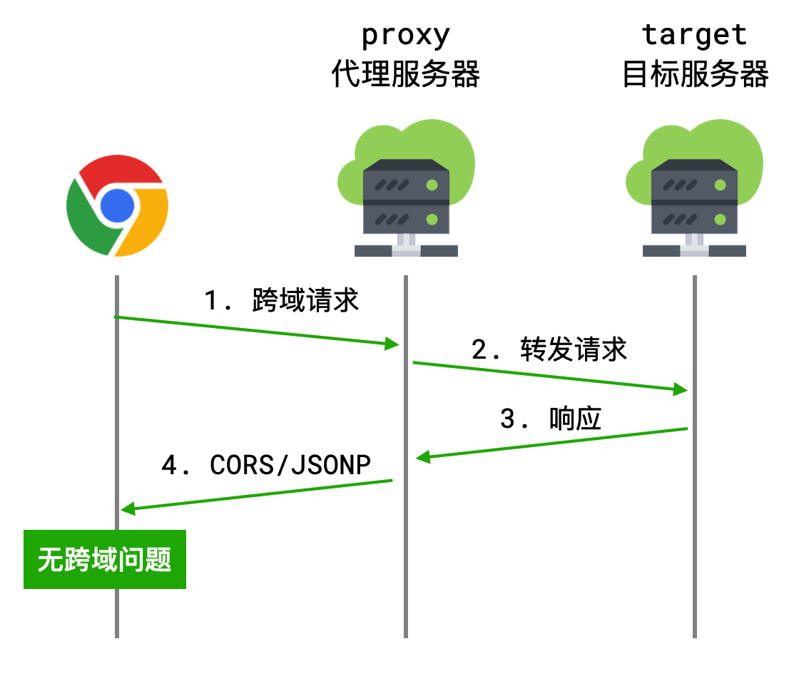
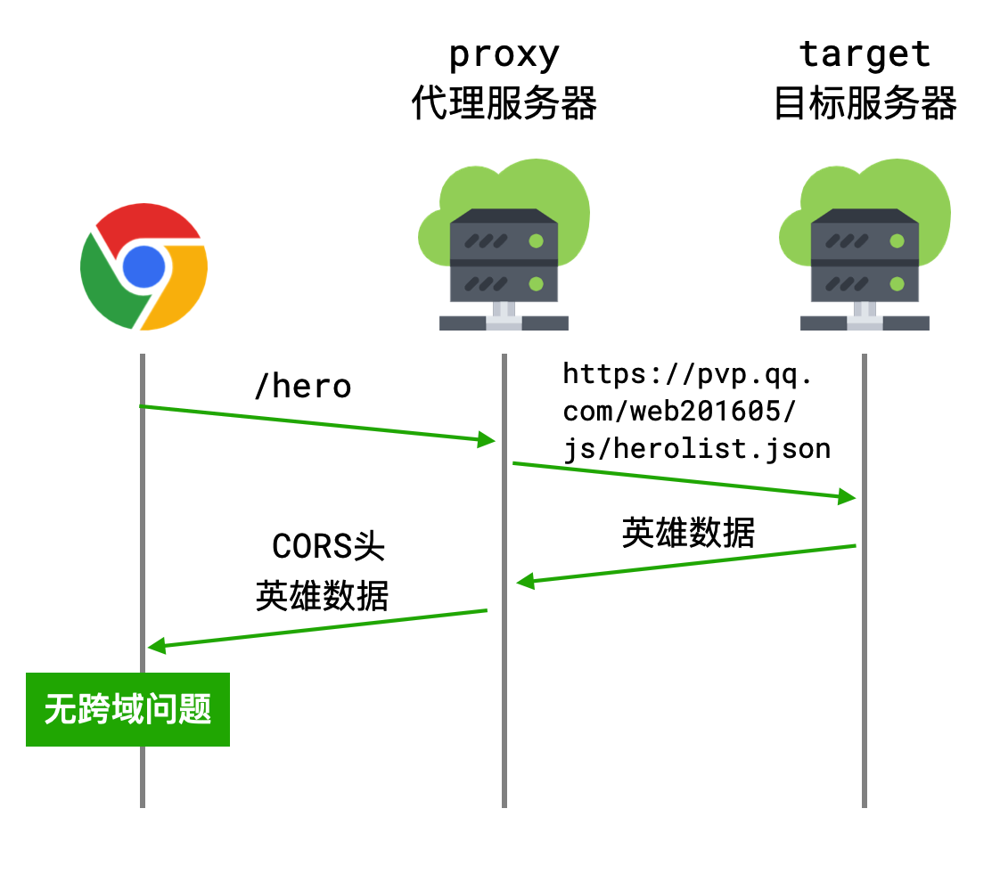
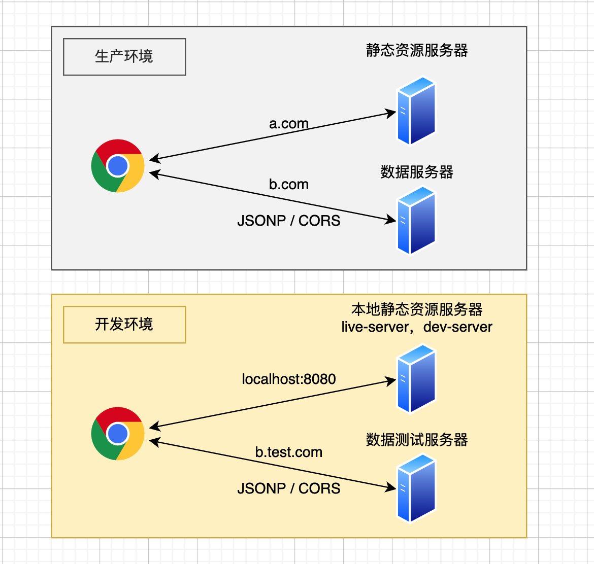

本文详细介绍了浏览器的同源策略及其导致的跨域问题，并提供了多种解决方案。首先解释了同源策略的概念和重要性，然后分析了CORS、JSONP和代理等不同的跨域解决方案的原理、优缺点及适用场景。文章还提供了实用的决策指南，帮助开发者根据实际情况选择最合适的跨域解决方案，同时强调了保持开发环境和生产环境一致性的重要性。


<!--truncate-->

# 浏览器跨域问题及解决方案

## 同源策略及跨域问题

**同源策略**是一套浏览器**安全机制**，当一个**源**的文档和脚本，与另一个**源**的资源进行通信时，同源策略就会对这个通信做出不同程度的限制。

简单来说，同源策略对 **同源资源** **放行**，对 **异源资源** **限制**

因此限制造成的开发问题，称之为**跨域（异源）问题**

### 同源和异源

```
源(origin) = 协议 + 域名 + 端口
```

例如:

`https://study.duyiedu.com/api/movie`的源为`https://study.duyiedu.com`

`http://localhost:7001/index.html`的源为`http://localhost:7001`

两个URL地址的源**完全相同**，则称之为**同源**，否则称之为**异源（跨域）**


### 跨域出现的场景

跨域可能出现在三种场景：

- **网络通信**

  a元素的跳转；加载css、js、图片等；AJAX等等

- JS API

  `window.open`、`window.parent`、`iframe.contentWindow`等等

- 存储

  `WebStorage`、`IndexedDB`等等

对于不同的跨域场景，以及每个场景中不同的跨域方式，同源策略都有不同的限制。

本文重点讨论**网络通信**中`AJAX`的跨域问题

### 网络中的跨域

当浏览器运行页面后，会发出很多的网络请求，例如CSS、JS、图片、AJAX等等

请求页面的源称之为**页面源**，在该页面中发出的请求称之为**目标源**。

当页面源和目标源一致时，则为**同源请求**，否则为**异源请求（跨域请求）**



### 浏览器如何限制异源请求？

浏览器出于多方面的考量，制定了非常繁杂的规则来限制各种跨域请求，但总体的原则非常简单：

- 对标签发出的跨域请求轻微限制
- 对AJAX发出的跨域请求**严厉限制**



## 解决方案

### CORS

CORS（Cross-Origin Resource Sharing）是最正统的跨域解决方案，同时也是浏览器推荐的解决方案。

CORS是一套规则，用于帮助浏览器判断是否校验通过。


CORS的基本理念是：

- 只要服务器明确表示**允许**，则校验**通过**
- 服务器明确拒绝或没有表示，则校验不通过

**所以，使用CORS解决跨域，必须要保证服务器是「自己人」**

#### 请求分类

CORS将请求分为两类：==简单请求==和==预检请求==。

对不同种类的请求它的规则有所区别。

所以要理解CORS，首先要理解它是如何划分请求的。

##### 简单请求

> 完整判定逻辑：https://developer.mozilla.org/en-US/docs/Web/HTTP/CORS#simple_requests

简单来说，只要全部满足下列条件，就是简单请求：

- 请求方法是`GET`、`POST`、`HEAD`之一

- 头部字段满足CORS安全规范，详见 [W3C](https://fetch.spec.whatwg.org/#cors-safelisted-request-header)

  > 浏览器默认自带的头部字段都是满足安全规范的，只要开发者不改动和新增头部，就不会打破此条规则

- 如果有`Content-Type`，必须是下列值中的一个

  - `text/plain`
  - `multipart/form-data`
  - `application/x-www-form-urlencoded`

##### 预检请求(preflight)

只要不是简单请求，均为预检请求

##### 练习

```js
// 下面的跨域请求哪些是简单请求，哪些是预检请求

// 1
fetch('https://douyin.com');

// 2
fetch('https://douyin.com', {
  headers: {
    a: 1,
  },
});

// 3
fetch('https://douyin.com', {
  method: 'POST',
  body: JSON.stringify({ a: 1, b: 2 }),
});

// 4
fetch('https://douyin.com', {
  method: 'POST',
  headers: {
    'content-type': 'application/json',
  },
  body: JSON.stringify({ a: 1, b: 2 }),
});
```

#### 对简单请求的验证



#### 对预检请求的验证

1. 发送预检请求


2. 发送真实请求（和简单请求一致）

#### 细节1 - 关于cookie

默认情况下，ajax的跨域请求并不会附带cookie，这样一来，某些需要权限的操作就无法进行

不过可以通过简单的配置就可以实现附带cookie

```js
// xhr
var xhr = new XMLHttpRequest();
xhr.withCredentials = true;

// fetch api
fetch(url, {
  credentials: "include"
})
```

这样一来，该跨域的ajax请求就是一个*附带身份凭证的请求*

当一个请求需要附带cookie时，无论它是简单请求，还是预检请求，都会在请求头中添加`cookie`字段

而服务器响应时，需要明确告知客户端：服务器允许这样的凭据

告知的方式也非常的简单，只需要在响应头中添加：`Access-Control-Allow-Credentials: true`即可

对于一个附带身份凭证的请求，若服务器没有明确告知，浏览器仍然视为跨域被拒绝。

另外要特别注意的是：**对于附带身份凭证的请求，服务器不得设置 `Access-Control-Allow-Origin 的值为*`**。这就是为什么不推荐使用*的原因

#### 细节2 - 关于跨域获取响应头

在跨域访问时，JS只能拿到一些最基本的响应头，如：Cache-Control、Content-Language、Content-Type、Expires、Last-Modified、Pragma，如果要访问其他头，则需要服务器设置本响应头。

`Access-Control-Expose-Headers`头让服务器把允许浏览器访问的头放入白名单，例如：

```
Access-Control-Expose-Headers: authorization, a, b
```

这样JS就能够访问指定的响应头了。

### JSONP

在很久很久以前...并没有CORS方案


在那个年代，古人靠着非凡的智慧来解决这一问题


虽然可以解决问题，但JSONP有着明显的缺陷：

- 仅能使用GET请求

- 容易产生安全隐患

  > 恶意攻击者可能利用`callback=恶意函数`的方式实现`XSS`攻击

- 容易被非法站点恶意调用

**因此，除非是某些特殊的原因，否则永远不应该使用JSONP**

### 代理

CORS和JSONP均要求服务器是「自己人」

那如果不是呢？


那就找一个中间人（代理）



比如，前端小王想要请求获取王者荣耀英雄数据，但直接请求腾讯服务器会造成跨域


由于腾讯服务器不是「自己人」，小王决定用代理解决



### 如何选择

最重要的，是要保持**生产环境和开发环境一致**

下面是一张决策图


具体的几种场景



