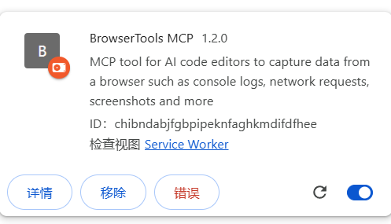

本文介绍了browser-tools-mcp工具，它能够让AI直接与浏览器进行交互。通过安装Chrome扩展和配置MCP服务器，AI可以访问浏览器的网络面板、控制台日志等信息，大大提升前端开发和调试效率。文章详细说明了安装步骤和基本配置方法，帮助读者快速上手这一强大工具。
<!--truncate-->

# 使用browser-tools-mcp，让AI对接浏览器

### browser-tools介绍

browser-tools 的 github地址：https://github.com/AgentDeskAI/browser-tools-mcp

该mcp可以赋予AI访问浏览器接口的能力，如让AI读取到浏览器网络面板上的信息，有助于前端页面的分析与开发

> MCP：Model Context Protocol 模型上下文协议
>
> 我的理解：MCP是统一了协议的 function call, MCP Server 本质是一段可以接收AI指令的node.js脚本

## 安装

1. 安装[BrowserToolsMCP Chrome Extension](https://github.com/AgentDeskAI/browser-tools-mcp/releases/download/v1.2.0/BrowserTools-1.2.0-extension.zip)

   解压该压缩包后，在Chrome浏览器的扩展程序中进行加载

   

2. 安装browser-tools-mcp

   在cline或其他其他ai工具中安装browser-tools-mcp，点击下图红色圈中的mcp-servers，并添加对应mcp配置

   

   ``` json
   //cline_mcp_settings.json
   {
       "mcpServers": {
           "browser-tools-mcp": {
               "command": "cmd",
               "args": [
                   "/c",
                   "npx",
                   "-y",
                   "@agentdeskai/browser-tools-mcp@latest"
               ],
               "autoApprove": [
                   "getConsoleLogs",
                   "getConsoleErrors",
                   "getNetworkErrors",
                   "getNetworkLogs",
                   "takeScreenshot",
                   "getSelectedElement",
                   "wipeLogs",
                   "runAccessibilityAudit",
                   "runPerformanceAudit",
                   "runSEOAudit",
                   "runNextJSAudit",
                   "runDebuggerMode",
                   "runAuditMode",
                   "runBestPracticesAudit"
               ]
           }
       }
   }
   ```

3. 安装mcp-server

   在cmd中运行下面的命令，运行后不要关闭

   ``` cmd
   npx @agentdeskai/browser-tools-server@latest
   ```

   

完成上面三步后，就可以愉快的跟AI和浏览器玩耍了


> 用了一段时间的感受：只能说AI还有很长的路要走吧，还有mcp真的很废token！！！不到10次请求用了我5$😢

